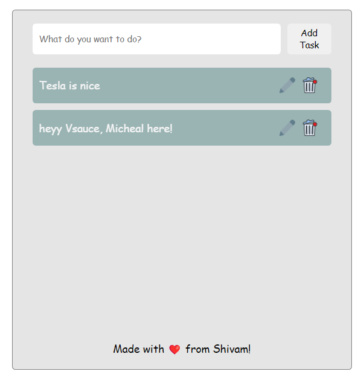

# Task Tracker - Express CRUD Server

Task Tracker is an Express-based server designed to handle CRUD operations for a React-based frontend application. The server provides APIs for managing tasks and logs request details into organized log files.
MongoDB is being used as primary database. We are only using the MongoDB driver for our implementation. 


## Features
- Fetch all tasks
- Create new tasks
- Update existing tasks
- Delete tasks by ID
- Request logging with timestamps and details

## APIs

### 1. Fetch All Tasks
**Endpoint:** "http://localhost:3000"  
**Method:** GET  
**Description:** Fetch all tasks stored on the server.  
**Response:** Returns an array of tasks.

---

### 2. Create a New Task
**Endpoint:** "http://localhost:3000/posts"  
**Method:** POST  
**Description:** Add a new task to the server.  
**Request Body:** JSON object containing the task details.  

---

### 3. Delete a Task by ID
**Endpoint:**"http://localhost:3000/posts/:id"  
**Method:** DELETE  
**Description:** Delete a task with the specified `:id`.  
**Response:** Confirms deletion.

---

### 4. Update a Task by ID
**Endpoint:** "http://localhost:3000/posts/:id"  
**Method:** PUT  
**Description:** Modify the task value/name for the task with the specified `:id`.  
**Request Body:** JSON object containing updated task data.  

---

## Request Logging
The server logs all incoming requests to log files stored in the `/public/logger/logs` directory. Logs are written in the following format:

```
DD/MM/YYYY, HH:MM:SS am/pm-localhost:3000/<endpoint>-<HTTP_METHOD>
```

### Example Log Entry:
```
16/11/2024, 1:39:23 am-localhost:3000/-GET
```

Each log file is named as `UTCDATE_server_log_file.txt`.

## Setup Instructions

1. Clone the repository:
   ```bash
   git clone https://github.com/singh-shivam789/task-tracker-server/
   cd task-tracker
   ```

2. Install dependencies:
   ```bash
   npm install
   ```

3. Create a .env file in the root directory and add any port like this: PORT = 3000

4. Start the server:
   ```bash
   npm start
   ```

5. Server will run on `http://localhost:PORT`.

task-tracker/
├── public/                           # Public directory
│   ├── config/                       # Configuration files
│   │   └── router/                   # Router configurations
│   │       └── routes/               # Routes for handling API requests
│   ├── data/                         # Contains application data
│   │   └── file.js                   # Main data file
│   ├── logger/                       # Logger directory
│   │   ├── logs/                     # Directory for log files
│   │   └── Logger.js                 # Logger implementation
├── index.js                          # Main server entry point
├── package.json                      # Dependencies and scripts
└── README.md                         # Project documentation


## Contributions
Contributions are not welcome!
